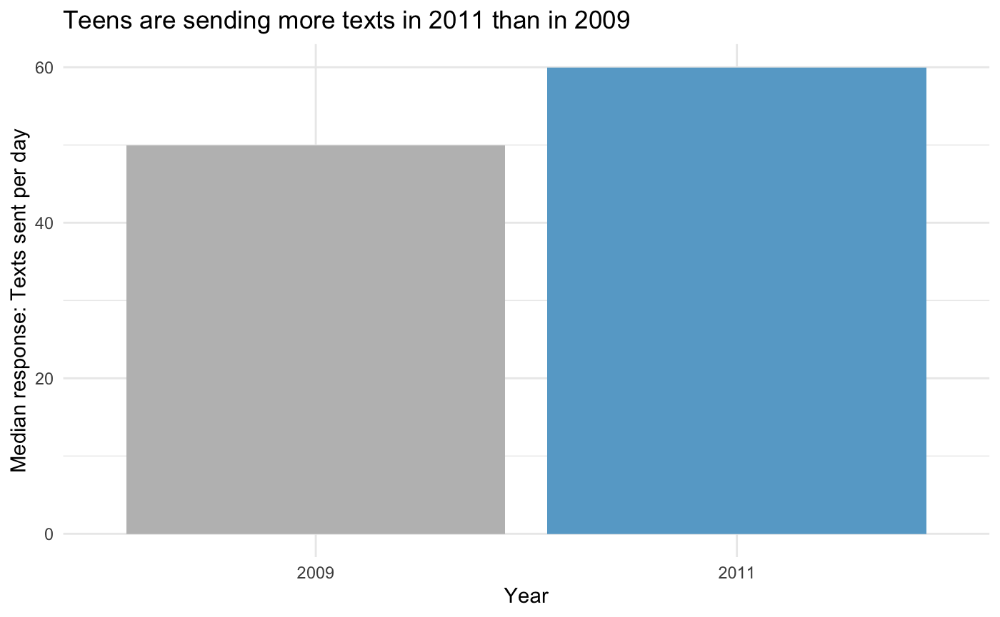
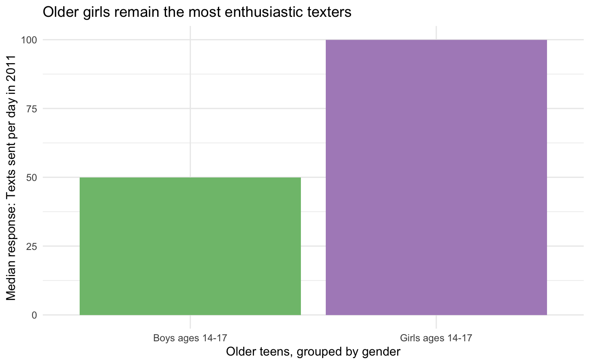

# The victim of this critique: A chart from a 2012 Pew report

The chart I chose to critique comes from a [2012 Pew Report](https://www.pewinternet.org/wp-content/uploads/sites/9/media/Files/Reports/2012/PIP_Teens_Smartphones_and_Texting.pdf) on teenagers, smartphones, and texting. (The previous link goes to the full PDF report. The relevant page in the online summary can be found [here](https://www.pewresearch.org/internet/2012/03/19/what-teens-do-with-their-phones/).)

My original Google Form responses to the Data Visualization Effectiveness Profile can be found [here](/assignment3-files/googleForm.pdf), so I won't reiterate all of those points.

Some of my complaints included:

* Given the title, my first impression was that the numbers at the tops of the bars were numbers of text messages, not the percentages that they actually are
* For data showing change over time like this, I think the default assumption is that the x-axis will reflect time
* I generally did not find that the pattern they were trying to emphasize (quite simply, that teens sent more texts in 2011 than in 2009) was obvious without looking at this graph for a long time, and the title doesn't make it any clearer (although the surrounding text in the report helps to contextualize the visual)

# Sketches

I first tried to redraw something very similar while maintaining the same general format as the original graph. I originally intended not to truncate the x-axis and allow it to go all the way to 100%, but I didn't like the amount of whitespace that created, since the differences between bars are already small and are even harder to see if the bars are shrunk to avoid truncating the axis.

The blue and gray graph on top of the image below is the one I discussed first with the people I interviewed (my partner Noah and my brother Will). (We mostly ignored the yellow/red/orange graph, because after drawing it I decided that it didn't make sense even to me.)

Noah first pointed out that the graph didn't have enough labels for it to make any sense at all, and I resolved that (corrected version shown below). After fixing that, I asked both of them to give their impressions of it with the main title covered (so that they didn't have text indicating that the main point was that more texts were sent in 2011), and both of them stared at it for a long time before saying anything at all. Noah never did decide what it meant, and Will finally did find the primary pattern and pointed out the bottom bar in particular, the >200 group.

Both said that this graph was overly complicated to make the broader point, especially given that the pattern was not consistent (e.g., the 101-200 group goes down, while the >200 group goes up). Noah didn't like this graph at all and said it wasn't really appropriate for any audience. Will said this graph was appropriate for an audience that was used to reading graphs, with a minimum of a high school education and good numeracy.

Will also said that he'd rather see this graph rotated 90° (i.e., the same as the original had been), but then when I showed him the original, he said that he didn't like it either: he said he really meant that it felt like the x-axis should show change over time.

Noah, a man with particular design sensibilities, finally remarked: "A graph should be two shapes. One should be bigger than the other. The end."

The top left graph below shows a much simpler representation of the overall point: one bar with the 2009 median, and one with the 2011 median.

Noah liked the version below much better and would have preferred to see it without the previous graph included at all. Will would have liked to see this simpler graph first but to have the previous graph included as context.

Will said the audience for this graph was "everyone." I think this is appropriate for a public Pew report, so I selected this as the main prototype to continue with.

The other two graphs in the image above were extra prototypes that I created to visualize other points that were described in the text of the report but not visualized. The bottom left one attempted to show that older teenagers are responsible for a large portion of the increase in the median number of texts from 2009 to 2011, since their median texts per day went from 60 to 100, but Noah said, "I don't understand how that graph relates to older teenagers vs. younger teenagers." I think it would require a more complex type of visualization to show that relationship. Since this relationship was tangential to the original graph anyway, I set this one aside.

The graph on the right is meant to visualize a sentence from the text that said that "older girls remain the most enthusiastic texters." Both interviewees said this graph was extremely easy to understand, so I drew it along with the final example. If I were rewriting this report for a public audience, I would probably include a few simple bar graphs like this rather than the more complex original graph.

# Final

I constructed this final version of the much-simpler bar plot of 2009 and 2011 medians based on the feedback I received on the sketches. Using gray for 2009 and blue for 2011 was intended to emphasize the current / larger 2011 data point. The title was intended to make the main point extremely clear for a public audience who could not be assumed to have any data science background. The design was otherwise minimal.

I tried to build this in Tableau, but it was having bizarre number formatting issues that I couldn't make sense of, so I built it in R/ggplot instead.

As discussed in more detail above: although it addresses an aspect of the data that the original graph was never intended to address, I also drew the graph below, to offer an example of the type of extremely simple graph that I think would have contributed more to this report than the more complicated one that I was critiquing.

---

# Runner-up candidates (just because I think they're interesting)

I found some interesting examples in Pew reports that were even older than the one I selected, like the examples below from a 2005 report about teenagers and technology. Probably due to software limitations at the time, they often just included tables for more complicated data, and they only included graphs if they were quite simple, like these. What I find notable about these is that while they do not follow best practices for visual design (rainbowy, unnecessary uses of ink like colored backgrounds and superfluous borders and redundant legends, etc.), it's still not difficult to figure out what they mean. I almost selected the second one for this assignment, but I started filling out the Google form and realized I didn't have many complaints about its accuracy or perceptibility, so I went digging again for something that actually caused confusion about the data.

In the past five or so years, Pew has achieved a really consistent design language in their charts. Charts in recent Pew reports are generally fairly clear, rarely use extra ink (no unnecessary borders, etc.), and only use a few colors. They do, however, sometimes make some strange sacrifices in order to maintain visual consistency (see the horizontal bar graphs in any recent Pew report, especially any that involve more than two variables). I also find this kind of graph unnecessarily difficult to interpret and would have critiqued this one if the data wasn't too new to be public:

---

[Back to Home](https://sarahpearman.github.io/data-stories/)
